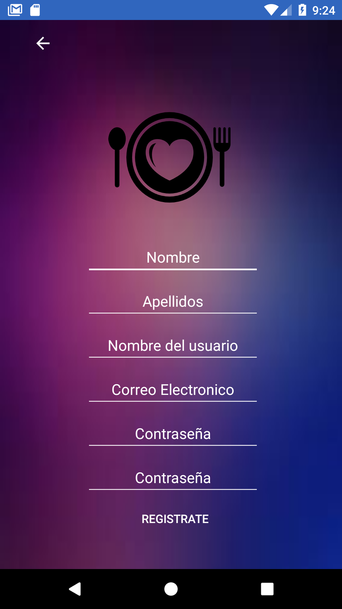
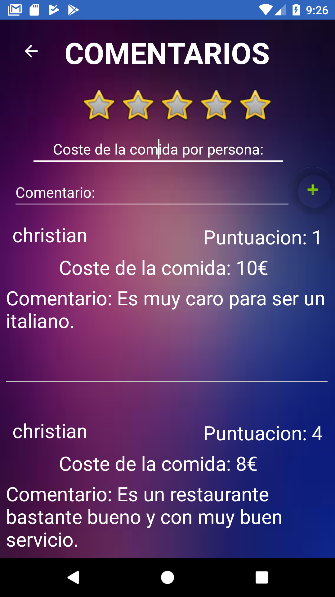
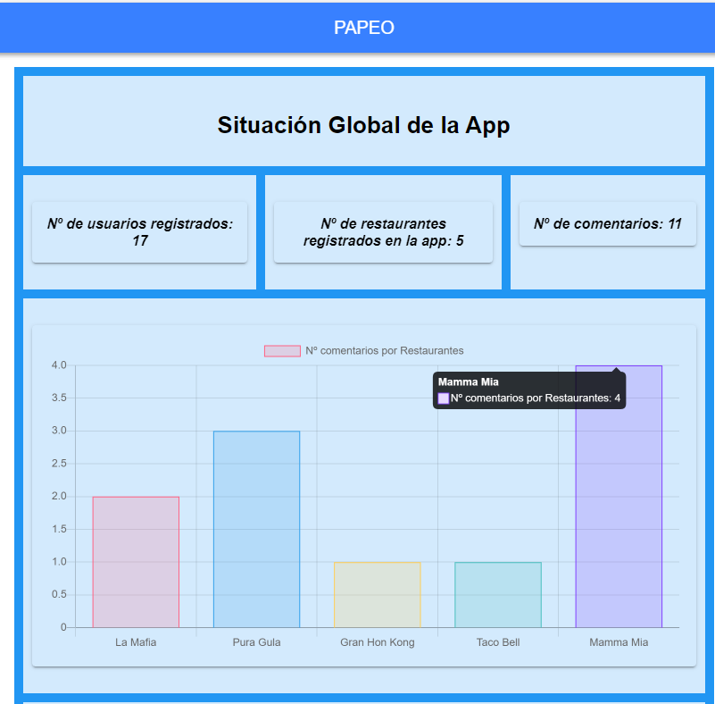

# PAPEO

## Herramientas

|      Hora     |  Curso |               Nombre                   |  Empresa          |
|:-------------|:------:|:--------------------------------------:|-----------------:|
| 09:00 - 09:20 | 2º DAM | García Ruiz, Cintia                    | Properly          |
| 09:20 - 09:40 | 2º DAW | Caballero Molina, Francisco Jesús      | Freepik           |
| 09:40 - 10:00 | 2º DAW | Sánchez, Adrián                        | BeSoccer          |
| 10:00 - 10:20 | 2º DAW | Villalba Sánchez, Adrián               | ITRS              |
| 10:20 - 10:40 | 2º DAW | Campos Jurado, Rafael                  | BCS               |
 |  |  

## Loguin

## Lista de restaurantes

## Loguin

## Información del restaurante

## Información extra del restaurante

## Comentarios

## Editar perfil

## Estadisticas

